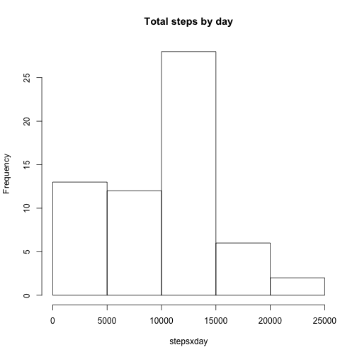
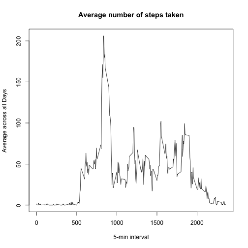
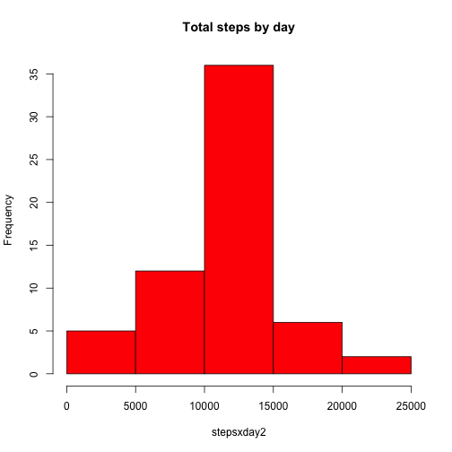
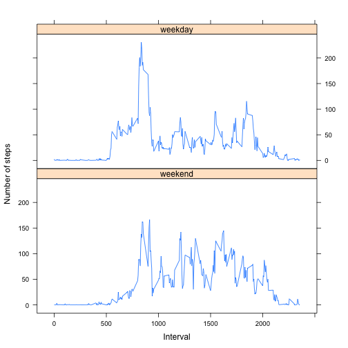

# Reproducible Research: Peer assessment 1

## Loading and preprocessing the data
I load the data reading the csv file "activity.csv" in my working directory.
In the same chunk I process the data putting the column Date in correct format.


```r
data<-read.csv("activity.csv")
data$date<-as.Date(data$date,"%Y-%m-%d")
```

## What is mean total number of steps taken per day?
Firstly I calculate the sum of steps taken per day using the tapply function.
With the results of the previous function I make a histogram of the total number of steps taken each day.


```r
stepsxday<-tapply(data$steps,data$date,sum,na.rm=T)
hist(stepsxday, main = "Total steps by day")
```

 

The median and the mean are:


```r
summary(stepsxday)[c("Median","Mean")]
```

```
## Median   Mean 
##  10400   9354
```

## What is the average daily activity pattern?

I make a time series plot of the 5-minute interval and the average number of steps taken, averaged across all days.


```r
stepsxint<-tapply(data$steps,data$interval,mean,na.rm=T)
plot(x=names(stepsxint),y=stepsxint,type="l",xlab = "5-min interval", 
     ylab = "Average across all Days", main = "Average number of steps taken")
```

 

The 5-minute interval containing the maximum number of steps is:


```r
stepsxint[stepsxint==max(stepsxint)]
```

```
##      835 
## 206.1698
```

## Imputing missing values

There are a number of days/intervals where there are missing values. The presence of missing days may introduce bias into some calculations or summaries of the data.

The total number of missing values in the dataset is:

```r
sum(is.na(data$steps))
```

```
## [1] 2304
```

I fill in all of the missing values in the dataset using the mean for that 5-minute interval. Then I create a new dataset equal to the original but with the missing data filled in. 


```r
data2<-data
data2$steps[is.na(data2$steps)] <-ave(data2$steps, data2$interval,
                                    FUN = function(x) 
                                    mean(x, na.rm = TRUE))[c(which(is.na(data2$steps)))]
```

I make a histogram of the total number of steps taken each day with the new dataset.


```r
stepsxday2<-tapply(data2$steps,data2$date,sum,na.rm=T)
hist(stepsxday2, main = "Total steps by day", col="red")
```

 


The mean and median total number of steps taken per day in the new dataset are:


```r
summary(stepsxday2)[c("Median","Mean")]
```

```
## Median   Mean 
##  10770  10770
```

As you see the new values differ from those calculated in the previous part.

## Are there differences in activity patterns between weekdays and weekends?

I use the weekdays() to create a new factor variable in the dataset with two levels – “weekday” and “weekend” indicating whether a given date is a weekday or weekend day.


```r
weekdays1 <- c('Lunedì', 'Martedì', 'Mercoledì', 'Giovedì', 'Venerdì')
data2$wDay <- factor((weekdays(data2$date) %in% weekdays1), 
                     levels=c(FALSE, TRUE), labels=c('weekend', 'weekday'))
```

I make a panel plot containing a time series plot of the 5-minute interval (x-axis) and the average number of steps taken, averaged across all weekday days or weekend days (y-axis). 


```r
library(lattice)
stepsByDay <- aggregate(steps ~ interval + wDay, data = data2, mean)
xyplot(steps ~ interval | wDay, stepsByDay, type = "l", layout = c(1, 2), 
    xlab = "Interval", ylab = "Number of steps")
```

 
